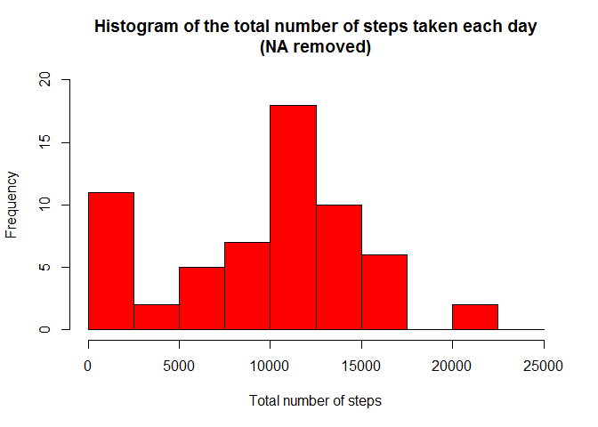
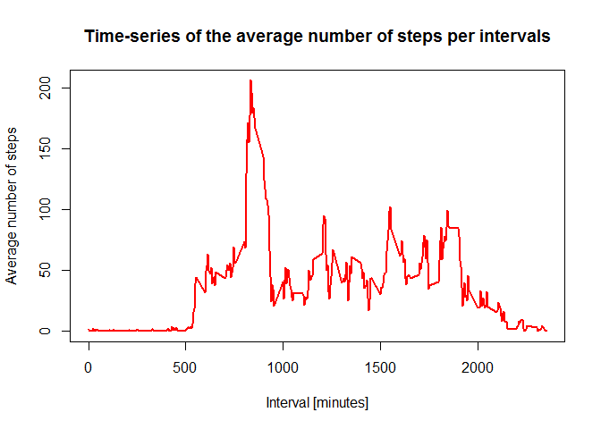
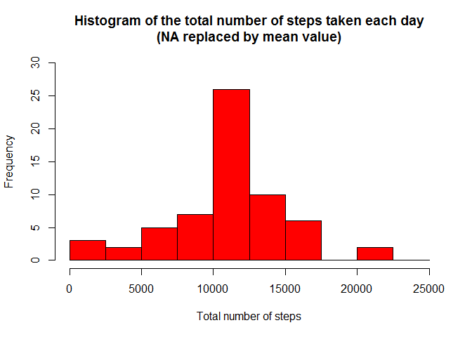

---
title: "Rmarkdown file"

#Loading and preprocessing the data

1.Load the data

```r
activity_raw <- read.csv("activity.csv", stringsAsFactors=FALSE)
```

2.Process/transform the data (if necessary) into a format suitable for your analysis


```r
# Transform the date attribute to an actual date format
activity_raw$date <- as.POSIXct(activity_raw$date, format="%Y-%m-%d")

# Compute the weekdays from the date attribute
activity_raw <- data.frame(date=activity_raw$date, 
                           weekday=tolower(weekdays(activity_raw$date)), 
                           steps=activity_raw$steps, 
                           interval=activity_raw$interval)

# Compute the day type (weekend or weekday)
activity_raw <- cbind(activity_raw, 
                      daytype=ifelse(activity_raw$weekday == "saturday" | 
                                     activity_raw$weekday == "sunday", "weekend", 
                                     "weekday"))

# Create the final data.frame
activity <- data.frame(date=activity_raw$date, 
                       weekday=activity_raw$weekday, 
                       daytype=activity_raw$daytype, 
                       interval=activity_raw$interval,
                       steps=activity_raw$steps)

# Clear the workspace
rm(activity_raw)
```

activity data frame


```r
head(activity)
```

```
##         date weekday daytype interval steps
## 1 2012-10-01  monday weekday        0    NA
## 2 2012-10-01  monday weekday        5    NA
## 3 2012-10-01  monday weekday       10    NA
## 4 2012-10-01  monday weekday       15    NA
## 5 2012-10-01  monday weekday       20    NA
## 6 2012-10-01  monday weekday       25    NA
```

#What is mean total number of steps taken per day?
you can ignore the missing values.

1. calculate the total number of steps taken each day 

```r
#The total number of steps taken per day

sum_data <- aggregate(activity$steps, by= list(activity$date), sum, na.rm=TRUE)

#rename the attributes
names(sum_data) <- c("date", "total")
```

sum_data data frame:


```r
head(sum_data)
```

```
##         date total
## 1 2012-10-01     0
## 2 2012-10-02   126
## 3 2012-10-03 11352
## 4 2012-10-04 12116
## 5 2012-10-05 13294
## 6 2012-10-06 15420
```

2.The histogram :

```r
# Make a histogram of the total number of steps taken each day

hist(sum_data$total, 
     breaks=seq(from=0, to=25000, by=2500),
     col="red", 
     xlab="Total number of steps", 
     ylim=c(0, 20), 
     main="Histogram of the total number of steps taken each day\n(NA removed)")
```

\

3. Calculate and report the mean and median of the total number of steps taken per day


```r
mean(sum_data$total)
```

```
## [1] 9354.23
```

```r
median(sum_data$total)
```

```
## [1] 10395
```

#What is the average daily activity pattern?

1.Make a time series plot (i.e. type = "l") of the 5-minute interval (x-axis) and the average number of steps taken, averaged across all days (y-axis)

```r
#compute the means of steps across all days for each interval

mean_data <- aggregate(activity$steps, by=list(activity$interval), mean, na.rm=TRUE)

#rename the attribute
names(mean_data) <- c("interval", "mean")
```

mean_data data frame:


```r
head(mean_data)
```

```
##   interval      mean
## 1        0 1.7169811
## 2        5 0.3396226
## 3       10 0.1320755
## 4       15 0.1509434
## 5       20 0.0754717
## 6       25 2.0943396
```

the plot is created as:

```r
#time series plot

plot(mean_data$interval, 
     mean_data$mean, 
     type="l", 
     col="red", 
     lwd=2, 
     xlab="Interval [minutes]", 
     ylab="Average number of steps", 
     main="Time-series of the average number of steps per intervals")
```

\

2.Which 5-minute interval, on average across all the days in the dataset, contains the maximum number of steps?


```r
# We find the position of the maximum mean
max_pos <- which(mean_data$mean == max(mean_data$mean))

# We lookup the value of interval at this position
max_interval <- mean_data[max_pos, 1]

head(max_interval)
```

```
## [1] 835
```

```r
# Clear the workspace
rm(max_pos, mean_data)
```
on average across all the days , is 835.

#Imputing missing values
Note that there are a number of days/intervals where there are missing values (coded as NA). The presence of missing days may introduce bias into some calculations or summaries of the data.
1.Calculate and report the total number of missing values in the dataset (i.e. the total number of rows with NAs)


```r
# We use the trick that a TRUE boolean value is equivalent to 1 and a FALSE to 0.
missing_count <- sum(is.na(activity$steps))

head(missing_count)
```

```
## [1] 2304
```

2.Devise a strategy for filling in all of the missing values in the dataset. The strategy does not need to be sophisticated. For example, you could use the mean/median for that day, or the mean for that 5-minute interval, etc.

```r
# Clear the workspace
rm(missing_count)

# Find the NA positions
na_pos <- which(is.na(activity$steps))

# Create a vector of means
mean_vec <- rep(mean(activity$steps, na.rm=TRUE), times=length(na_pos))
head(mean_vec)
```

```
## [1] 37.3826 37.3826 37.3826 37.3826 37.3826 37.3826
```

3.Create a new dataset that is equal to the original dataset but with the missing data filled in.


```r
activity[na_pos, "steps"] <- mean_vec
```

activity data frame :

```r
head(activity)
```

```
##         date weekday daytype interval   steps
## 1 2012-10-01  monday weekday        0 37.3826
## 2 2012-10-01  monday weekday        5 37.3826
## 3 2012-10-01  monday weekday       10 37.3826
## 4 2012-10-01  monday weekday       15 37.3826
## 5 2012-10-01  monday weekday       20 37.3826
## 6 2012-10-01  monday weekday       25 37.3826
```

4.Make a histogram of the total number of steps taken each day and Calculate and report the mean and median total number of steps taken per day. Do these values differ from the estimates from the first part of the assignment? What is the impact of imputing missing data on the estimates of the total daily number of steps?


```r
sum_data <- aggregate(activity$steps, by=list(activity$date), sum)

# Rename the attributes
names(sum_data) <- c("date", "total")

# Compute the histogram of the total number of steps each day
hist(sum_data$total, 
     breaks=seq(from=0, to=25000, by=2500),
     col="red", 
     xlab="Total number of steps", 
     ylim=c(0, 30), 
     main="Histogram of the total number of steps taken each day\n(NA replaced by mean value)")
```

\

so the mean and median are :

```r
mean(sum_data$total)
```

```
## [1] 10766.19
```

```r
median(sum_data$total)
```

```
## [1] 10766.19
```

These values differ greatly from the estimates from the first part of the assignment. The impact of imputing the missing values is to have more data, hence to obtain a bigger mean and median value.

#Are there differences in activity patterns between weekdays and weekends?

For this part the weekdays() function may be of some help here. Use the dataset with the filled-in missing values for this part.

1.Create a new factor variable in the dataset with two levels - "weekday" and "weekend" indicating whether a given date is a weekday or weekend day.


```r
head(activity)
```

```
##         date weekday daytype interval   steps
## 1 2012-10-01  monday weekday        0 37.3826
## 2 2012-10-01  monday weekday        5 37.3826
## 3 2012-10-01  monday weekday       10 37.3826
## 4 2012-10-01  monday weekday       15 37.3826
## 5 2012-10-01  monday weekday       20 37.3826
## 6 2012-10-01  monday weekday       25 37.3826
```

2.Make a panel plot containing a time series plot (i.e. type = "l") of the 5-minute interval (x-axis) and the average number of steps taken, averaged across all weekday days or weekend days (y-axis). See the README file in the GitHub repository to see an example of what this plot should look like using simulated data.


```r
#clear the workspace
rm(sum_data)

#load the lattice 
library(lattice)

#The average number of steps taken
  mean_data <- aggregate(activity$steps, by=list(activity$daytype, activity$weekday, activity$interval), mean)
  
  #rename the attributes
  names(mean_data) <- c("daytype", "weekday", "interval", "mean")
```
mean_data data frame:

```r
  head(mean_data)
```

```
##   daytype  weekday interval     mean
## 1 weekday   friday        0 8.307244
## 2 weekday   monday        0 9.418355
## 3 weekend saturday        0 4.672825
## 4 weekend   sunday        0 4.672825
## 5 weekday thursday        0 9.375844
## 6 weekday  tuesday        0 0.000000
```

The time series plot is:

```r
 xyplot(mean ~ interval | daytype, mean_data, 
       type="l", 
       lwd=1, 
       xlab="Interval", 
       ylab="Number of steps", 
       layout=c(1,2))
```

\
